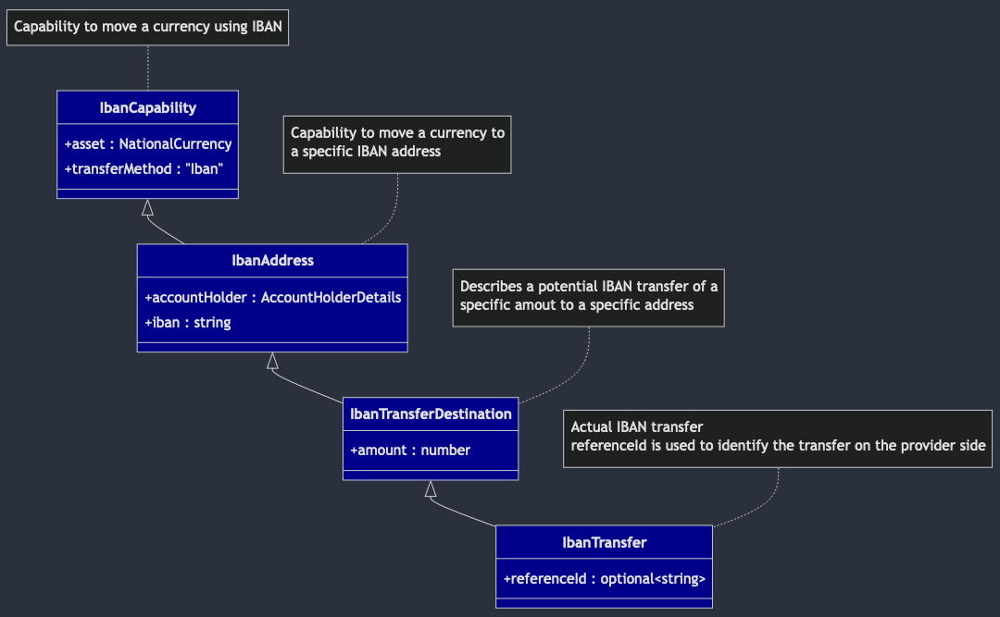
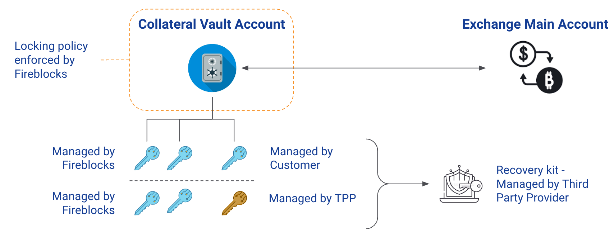
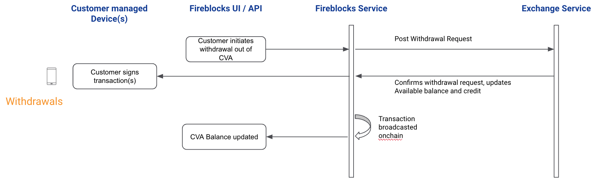
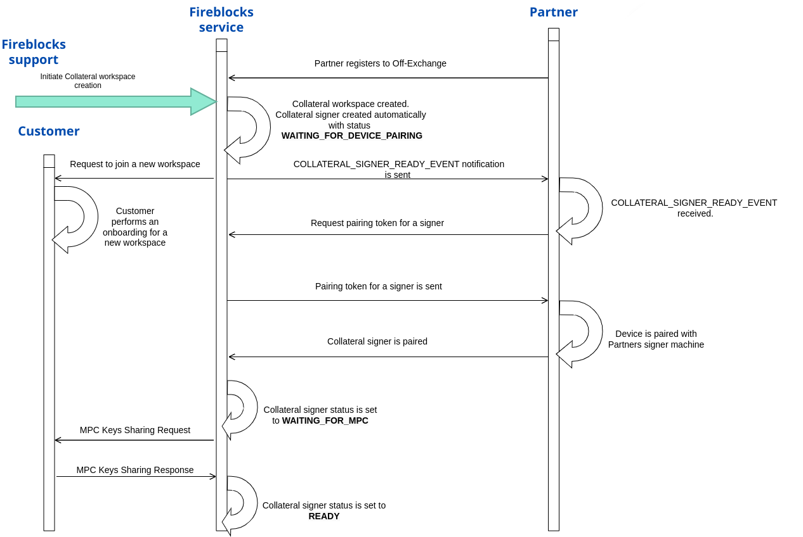
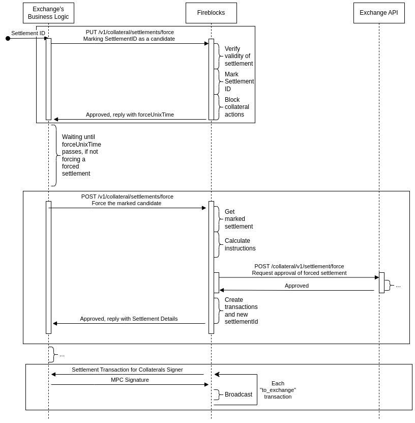
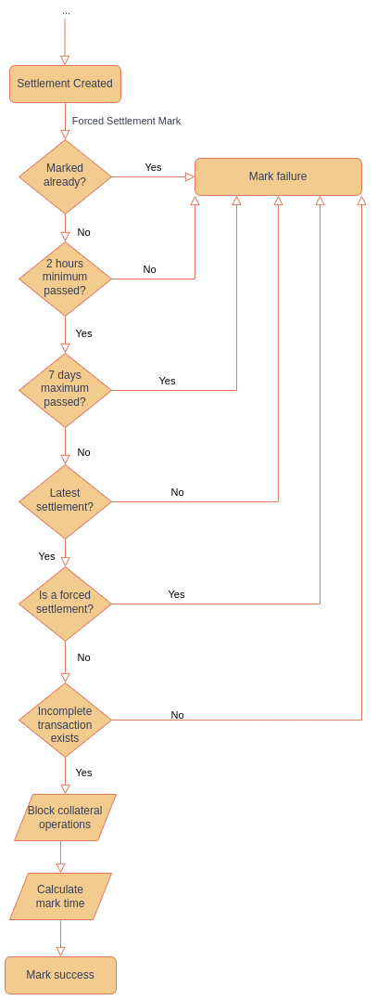
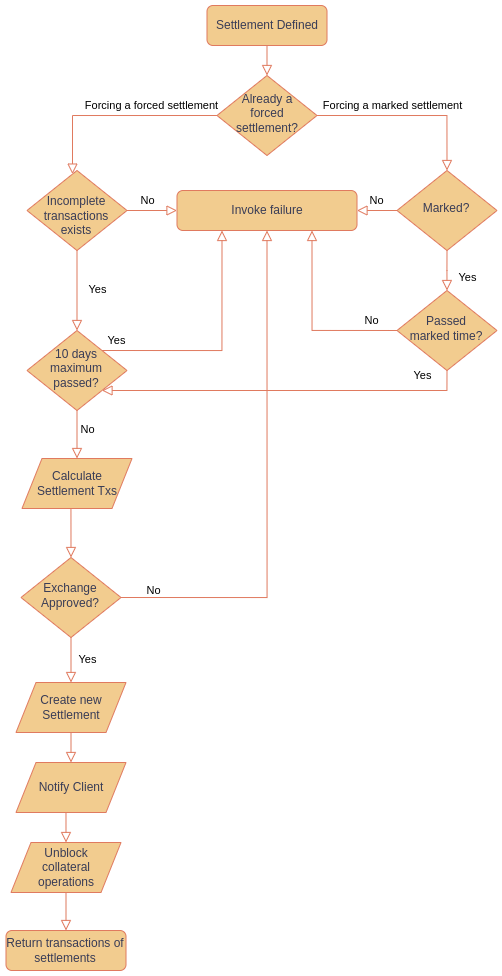

Fireblocks Provider Connectivity API defines the interface for integration of third-party
providers into Fireblocks platform.

# Introduction

Fireblocks connects businesses across the crypto world as the digital asset infrastructure
for over 1,800 leading trading desks, hedge funds, brokerages, custodians, 3rd parties,
and banks. To meet the demand for third-party services that want to access the liquidity
of institutional investors and traders, Fireblocks is opening its platform for fast
third-party integration.
As part of an initiative to make sure that the end user still has complete control over
their own assets, the provider can offer an Off Exchange solution.
This way, the end user can enjoy the various benefits of the exchange while avoiding the
risk of a centralized malfunction, all through the Fireblocks platform.
Reach out to us for a partnership agreement and add a Connector
to have your product integrated.

Further reading:

- [Listing Your Service on the Provider Network ⧉](https://support.fireblocks.io/hc/en-us/articles/22144765384348-Listing-your-service-on-the-Provider-Network)
- [Network Link Integration Guide for Provider Connectivity ⧉](https://developers.fireblocks.com/docs/network-link-integration-guide-for-provider-connectivity)

# API Usage Guide

## IDs

The API uses textual properties to identify its resources. These properties are called
`id` when they identify the parent resource. ID property names that are prepended by
a resource name point to some other resource; for example, `assetId` or `accountId`.
The IDs must uniquely identify each resource. Other than that the API does not require
the IDs to have any specific structure.

## Idempotency

Servers implementing the API are expected to be
[idempotent](https://en.wikipedia.org/wiki/Idempotence). That is, a client should be able
to safely retransmit the same request, being confident that the server will execute the
operation only once.

Request idempotence is achieved by adding `idempotencyKey` property to requests that
create or modify server resources. All retries of the same requests are sent containing
the same unique idempotency key. Clients will never reuse an idempotency key for other
requests.

When a server encounters a request with a previously used idempotency key, it should act
as follows:

- If the original request is different from the new one, despite having the same
  idempotency key, the server should respond with HTTP status code 400 and response
  body containing a JSON object with the following properties:
  ```json
  {
    "message": "<Description of the error>",
    "errorType": "idempotency-key-reuse",
    "propertyName": "idempotencyKey",
    "requestPart": "body"
  }
  ```
- If the original request was handled with HTTP response status code 2xx or 4xx,
  the server should return exactly the same response with exactly the same status code.
- If the original request was handled with HTTP response status code 5xx,
  the server should handle the new request and consider the new response as the original
  response when handling any consecutive retries.

Servers are expected to recognize a retry for 72 hours, at least, since the last attempt.

## Pagination

All API endpoint returning lists of entities use pagination to limit the number of items
returned in a response. The pagination is controlled by the following query parameters:

| Parameter       | Description                                                                                    |
| --------------- | ---------------------------------------------------------------------------------------------- |
| `limit`         | The maximum number of items to return in a single response.                                    |
| `startingAfter` | Item ID. Instructs to return the items immediately following this object and not including it. |
| `endingBefore`  | Item ID. Instructs to return the items immediately preceding this object and not including it. |

- Notice that all the endpoints returning lists of items are defined to return an object
  with a property containing the list.
- If the requested query parameters result in an empty list, the server should still
  return the defined object with the list property set to an empty array.
- All the pagination query parameters are optional. If not provided, the server should
  return the first page of items.
- The returned dataset should never contain the item specified by the `startingAfter` or
  `endingBefore` parameter.
- `endingBefore` and `startingAfter` are mutually exclusive. If both are provided, the
  server should respond with HTTP status code 400 and response body containing a JSON
  object with the following properties:
  ```json
  {
    "message": "Only one of the parameters 'startingAfter' and 'endingBefore' can be used.",
    "errorType": "invalid-query-parameters",
    "propertyName": "startingAfter",
    "requestPart": "query"
  }
  ```

## Capabilities

The API consists of separate optional components with flexible capabilities. Fireblocks
platform uses `/capabilities/*` endpoints to discovery dynamically the supported
components
and capabilities.

The discovery process starts with calling `GET /capabilities`. The response specifies
the implemented API version and an array of the supported API capabilities; for example,
this response indicates that all the capabilities are supported:

```json
{
  "version": "0.1.1",
  "components": {
    "accounts": "*",
    "balances": "*",
    "transfers": "*",
    "transfersBlockchain": "*",
    "transfersFiat": "*",
    "transfersPeerAccounts": "*",
    // "trading": "*",
    "liquidity": "*",
    "ramps": "*"
  }
}
```

If a capability is supported only by a specific sub-account, the value of a capability
could
be replaced by a list of account IDs:

```json
{
  "version": "0.1.1",
  "components": {
    "accounts": "*",
    "balances": "*",
    "transfers": [
      "6cd2fe1e-d0bc-4fad-a9ba-9384e0fdfdc0",
      "7885a47b-0719-4448-b59e-3b8497cd1685"
    ]
  }
}
```

Based on the response, Fireblocks platform will use the endpoints specific to each
component to discover the specific capabilities for each component.

## Security

To ensure secure communication the protocol specifies several HTTP headers that must be
sent with each HTTP request:

- `X-FBAPI-KEY` - a secret token used to identify and authenticate the API caller.
- `X-FBAPI-TIMESTAMP` - request creation UTC time, expressed in milliseconds since Unix
  Epoch.
- `X-FBAPI-NONCE` - request universal unique identifier (UUID).
- `X-FBAPI-SIGNATURE` – request cryptographic signature, signed using the provider private key.
- `X-FB-PLATFORM-SIGNATURE` - appears only in the Off-Exchange requests sent from Fireblocks;
  contains request cryptographic signature, signed using Fireblocks private key.

### Signature

HTTP request signature is calculated by applying a sequence of operations to the request
data. The cryptographic keys and the specific operations used by a server are defined
during the server on-boarding.

#### Building the message to sign

Build the message by concatenating the following parts of the request in this specific
order:

1. Timestamp — the request timestamp as it appears in `X-FBAPI-TIMESTAMP` header;
2. Nonce — the request nonce as it appears in `X-FBAPI-NONCE` header;
3. Method — the HTTP method of the request in upper case;
4. Endpoint — the request URL, including the query string, without prefixes;
5. Request body — the body of the HTTP request, when exists.

For example, let's assume a client decides to get the first two balances of the account
with ID `A1234`. These are the request properties:

| Property     | Value                                      |
| ------------ | ------------------------------------------ |
| Timestamp    | `1691606624184` (2023-08-09T18:43:44.184Z) |
| Nonce        | `c3d5f400-0e7e-4f94-a199-44b8cc7b6b81`     |
| Method       | `GET`                                      |
| Endpoint     | `/accounts/A1234/balances?limit=2`         |
| Request body | no request body for this request           |

The message to sign will
be: `1691606624184c3d5f400-0e7e-4f94-a199-44b8cc7b6b81GET/accounts/A1234/balances?limit=2`

#### Computing the signature

The signature is computed by applying a pre-encoding function, a signing algorithm and
a post-encoding function to the message. A server can implement one of the several
supported options and specify the choice during the server on-boarding process. The same
signing method will be used for all the requests.

These are the supported algorithms:

Pre-encoding:

- URL encoded
- Base64
- HexStr
- Base58
- Base32

Post-encoding:

- Base64
- HexStr
- Base58
- Base32

Notice that URL encoding is not supported for post-encoding.

Signing algorithms and possible hash functions:

- HMAC (SHA512, SHA3_256, or SHA256)
- RSA PKCS1v15 (SHA512, SHA3_256, or SHA256)
- ECDSA prime256v1/secp256k1 (SHA256 only)

### Off-Exchange (Collateral) platform signature

Off-Exchange (Collateral) integration assumes bi-directional communication. All the requests,
sent as part of this integration, from Fireblocks to a provider's servers, contain an additional
header named `X-FB-PLATFORM-SIGNATURE`. This header contains the request signature signed with
Fireblocks private key. All providers are expected to validate this signature.

- [Public keys for the signature validation](https://developers.fireblocks.com/docs/off-exchange)

The signed message is built identically to the [provider signature](#building-the-message-to-sign).
The signature itself is calculated by applying SHA512 pre-encoding function, applying RSA PKCS1v15
signing algorithm, and finally applying base64 encoding to the result.

The signature verification usually consists of these steps:
1. Build the message, as [described above](#building-the-message-to-sign).
2. Calculate the message hash by applying SHA512 to the message.
3. Get the value of the `X-FB-PLATFORM-SIGNATURE` header.
4. Base64 decode the value to get the actual signature.
5. Decrypt the signature using RSA PKCS1v15 and the
   [Fireblocks public key](https://developers.fireblocks.com/docs/off-exchange).
6. If the result is identical to the message hash, the signature is valid.

Notice, that in many frameworks, some of these steps are combined into a single step.

## Assets and transfer methods

An asset in Fireblocks Connectivity API is either a national currency
(per [ISO-4217](https://en.wikipedia.org/wiki/ISO_4217)), one
of the blockchain native cryptocurrencies, explicitly listed in the API specification, or
an arbitrary blockchain token. A provider can choose to support test
versions of assets by setting testAsset flag in the capabilities response.

Any token used anywhere in the API must be listed in the response to `GET
/capabilities/assets`. The returned object assigns a unique ID to each token. When an
asset
is used in a request or a response it is identified by its code/symbol, if it is an asset
predefined by the API specification; otherwise, it is identified by the aforementioned
unique ID.

> National currencies and blockchain native currencies (e.g., BTC and ETH) can be
> specified without listing them in `/capabilities/assets`.

Transfer methods define how assets are withdrawn and deposited. Each transfer method
starts as a capability. Given a capability, it can be used to define transfer addresses.
Finally, an address is used to make an actual transfer.

For example, calling `GET /capabilities/transfers/withdrawals` could return the following
object:

```json
[
  {
    "balanceAsset": {
      "coinType": "NationalCurrency",
      "currencyCode": "USD"
    },
    "capability": {
      "transferMethod": "PublicBlockchain",
      "blockchain": "Ethereum",
      "asset": {
        "assetId": "a36c6daa-8ce9-4fd5-9b1d-5c33901a08e9"
      }
    }
  }
]
```

And `GET /capabilities/assets` return

```json
[
  {
    "id": "a36c6daa-8ce9-4fd5-9b1d-5c33901a08e9",
    "name": "Tether USD",
    "symbol": "USDT",
    "type": "Erc20Token",
    "decimalPlaces": 6,
    "blockchain": "Ethereum",
    "decimalPlaces": 6,
    "contractAddress": "0xdAC17F958D2ee523a2206206994597C13D831ec7"
  }
]
```

Combining the two responses together allows the client to understand that the server
supports withdrawal of USD balances as USDT over Ethereum blockchain.

In the next step, this capability could be used to define a specific withdrawal
destination:

```json
{
  "transferMethod": "PublicBlockchain",
  "blockchain": "Ethereum",
  "asset": {
    "assetId": "a36c6daa-8ce9-4fd5-9b1d-5c33901a08e9"
  },
  "amount": "10",
  "address": "0xEC52EC04b660a15B6C7A7C8C85f102B2C6cb2697",
  "blockchainTxId": "0xb3b773aaf5929b2f94db973da8bb6f31b334cc57eaef872bd927119946067843"
}
```

Notice, that in a deposit or a withdrawal operation the operation asset and the balance
asset are specified separately, thus enabling scenarios when assets appear as different
currencies when they "move".

Moreover, it is possible to define balances as arbitrary buckets, as long as there is a
clear definition which assets can be deposited and withdrawn from the bucket.

The same principles apply to fiat transfers. In general, asset transitions could be
described as follows:

```
    ┌───────────┐    ┌───────────┐    ┌──────────────┐    ┌───────────┐    ┌──────────────┐
    │  Deposit  │    │  Balance  │    │              │    │  Balance  │    │  Withdrawal  │
    │           ├───►│           ├───►│  Conversion  ├───►│           ├───►│              │
    │  Asset 1  │    │  Asset 2  │    │              │    │  Asset 3  │    │   Asset 4    │
    └───────────┘    └───────────┘    └──────────────┘    └───────────┘    └──────────────┘
Example: MXN              MXN                                  USD               USDC
```

### Transfer method definition in the API spec

Let's look in detail at how a transfer method is defined and used throughout the API.
All the transfer methods use the same pattern. We will take the IBAN transfer method
as an example.

There are four objects, extending one another, that define the IBAN transfer method:

1. `IbanCapability` – used to define that an asset can be transferred using IBAN. For
   example, this object is returned by the withdrawal capabilities (getWithdrawalMethods)
   and deposit capabilities (getDepositMethods) endpoints.
2. `IbanAddress` – extends `IbanCapability` and adds to it the IBAN address property and
   account holder details. This object is used in deposit address management endpoints,
   for example in createDepositAddress and getDepositAddresses.
3. `IbanTransferDestination` - extends `IbanAddress` and adds to it the amount property.
   This object is used in for creation of fiat withdrawals (createFiatWithdrawal
   endpoint). Notice how `IbanAddress` is not enough for withdrawals but is enough for
   deposits, where the amount property is not needed.
4. `IbanTransfer` – used to describe existing fiat withdrawal, for example in
   getFiatWithdrawals endpoint. It extends `IbanTransferDestination` and adds to it the
   reference ID property to help correlate a withdrawal to a specific transaction on the
   transaction recipient side.



When a client retrieves a withdrawal details, an `IbanTransfer` object is returned in the
`destination` property; for example:

```json5
{
  asset: {
    // defined in IbanCapability
    nationalCurrencyCode: "USD", // defined in NationalCurrency
  },
  transferMethod: "Iban", // defined in IbanCapability
  iban: "GB33BUKB20201555555555", // defined in IbanAddress
  accountHolder: {
    // defined in IbanAddress
    name: "Stephen Vincent Strange", // defined in AccountHolderDetails
    city: "New York City", // defined in AccountHolderDetails
    country: "USA", // defined in AccountHolderDetails
    subdivision: "NY", // defined in AccountHolderDetails
    address: "177A Bleecker Street", // defined in AccountHolderDetails
    postalCode: "10012-1406", // defined in AccountHolderDetails
  },
  amount: "13.37", // defined in IbanTransferDestination
  referenceId: "f9ff7738-92ea-48c8-8e80-68112d46f424", // defined in IbanTransfer
}
```

## Off-Exchange (Collateral)

### Background

The purpose of the Fireblocks collateral account is to enable a middle ground for Traders and Exchanges where Traders assets are not stored in Exchange’s private ledger, yet the exchange get the comfort to lend against the collateral account assets, by having the collateral assets locked by Fireblocks, preventing the Trader from removing collateral assets without getting Exchange confirmation first.

### Two-way integration

The collateral capability is a two-way integration between Fireblocks and the provider.
Fireblocks will send requests to the provider for most cases, but some actions or data fetch will be initiated by the provider.

The Fireblocks to Provider requests are described in this API specification.
The Provider to Fireblocks requests are listed below (refer to the Fireblocks API specification for the full details):

- `GET /v1/collateral/transactions/{collateralTxId}`
- `POST /v1/collateral/settlements`
- `GET /v1/collateral/settlements/{settlementId}/transactions`
- `GET /v1/collateral/address/{assetId}`
- `PUT`/`GET`/`DELETE`/`POST` `/v1/collateral/settlements/force`
- `POST /v1/collateral/signers/token`
- `GET /v1/collateral/workspaces`
- `GET /v1/collateral/signers/data`
- `POST /v1/collateral/notify`

### Account structure and account linking (API key replace)

Fireblocks enables users to link their provider accounts to their workspace.

Once the account is connected, the user can at run the supported actions from the Fireblocks workspace.

For the collateral assets, Fireblocks will open a dedicated vault account which will be called Collateral Vault Account (CVA).
Any assets added to the CVA will be locked by the Fireblocks Policy and removing collateral assets from the CVA will require the provider’s confirmation.

Fireblocks users will be able to add collateral for main accounts only (MA).

There is a 1:1 relation between a CVA and a main account (MA).

The expected flow is for traders to add collateral for an MA, gain credit on their MA balance, and then allocate assets to the various MA sub-accounts.

The provider is expected to register a `collateralId` to an internal `accountId` and in case of an API key replacement, to respond to a CVA list request with the existing `collateralId`.

For settlements, traders would need to transfer assets up to the MA as settlements will be executed on the CVA and MA balances only.

### Deposit/Withdraw Vs Remove/Add

The collateral functionality should apply to any main account of a customer that has enabled this functionality.
Meaning, once a customer is eligible and onboarded, all the existing main accounts of this customer should be enabled for gaining credit against CVA assets, while maintaining the usual deposit and withdrawal functionality.

We use the terms ‘add collateral’ and ‘remove collateral’ to distinguish between the CVA and the MA. For the MA, we keep referring with the usual deposit and withdraw terminology.

Please be aware that Fireblocks expect the deposits and withdrawals to and from the MA to remain active and available for CVA-linked MAs.

If a withdrawal from a MA is denied due to outstanding MA credit or customer-level credit, the provider is expected to respond with a ‘settlement is required’ status.

### Post Address and Addresses list

As mentioned, FB will send a POST request each time a collateral is added via the FB system.
The request will include the address(es) to which the collateral assets are deposited.
The provider is expected to identify whether the address(es) are new and if so, add the new addresses to the CVA addresses list.

### Balance types

Once a CVA is created for a MA, Fireblocks will start presenting Traders with 3 types of provider balance.

1. MA Total/Available balance.

- This is the usual balance that is presented to non-CVA users as well.

2. MA credit balance.

- This is a new type of balance, supplied to Fireblocks by the provider, and reflects the outstanding credit the MA gained from the provider treasury in accordance with the locked CVA assets.
- The credit balance does not have to be equal to the CVA balance.
  - For example, if Trader adds 100 BTC as collateral but provider decides to credit the MA with 40 BTC only, due to risk management considerations and Trader cross-accounts credit utilization, then the credit balance would be 40 BTC while 100 BTC are stored in the CVA.
    - In this case, if Trader asks to remove the 60 BTC surplus from the CVA, provider should confirm this collateral removal.

3. MA collateral balance.

- This is in fact the CVA balance which is being managed by Fiireblocks.

### Capabilities and features

Initiation - we send Collateral ID and we want to get back a success with Collateral ID. If the API Key we use is of an account that already has a collateral ID, we want the success message to contain the existing collateral ID and we will not use the new one.

### Network fees

Settlement transactions are on-chain transactions. provider should estimate future fees once crediting a Trader account relying on the CVA locked assets.

provider A may choose to credit 1:1 (e.g 1 BTC credit for each 1 BTC in CVA), but to ask for settlements earlier than provider B that chooses to credit 0.8:1 in order to keep aside an amount to cover settlement transactions’ network fees.

### Gas

Settlements that involve gas-powered assets transferred from a CVA to an provider OTA, require the Trader to make sure there’s enough gas.

As a fallback, provider can deposit gas to the CVA by querying for the Ethereum address or any other base asset address.

At this time, Fireblocks will not manage gas stations for CVAs.

### Collateral ID

The identifier of the CVA is called ‘collateral ID’ and is represented as a series of 3 uuid4 formats separated with a . delimiter.

### Supported Assets

Fireblocks keeps a record of each provider supported assets. On each deposit into the CVA, Fireblocks sends a POST call to the provider with the address to which the asset is being deposited, the name of the asset and network as the provider defined them, and the unique fireblocksAssetId which the provider needs to track in order to communicate with Fireblocks about this asset.

Fireblocks will not allow users to add unsupported assets as collateral. A caveat to that rule is that a user may transfer funds to a CVA not via the Fireblocks UI/API. In that case, the provider would not get a POST ‘address’, and may ignore that deposit, not credit against it, and confirm its removal once asked for.

Assets that Fireblocks do not support cannot be included in settlements.
If a non-supported asset is at the MA and needs to settle, the provider wouldn't be able to include it in the settlement as there isn’t any Fireblocks Asset Id for assets that Fireblocks do not support.

### Settlements

As settlement transactions are on-chain transactions, frequency based settlements are not recommended, to minimize network fees. Instead, the best practice for providers to trigger settlements would be based on the value difference between the CVA assets and the total provider account value (including unrealised P&L).
Traders may trigger settlements after spot trading where the value difference may be minimal, but for the provider-side settlement-logic, risk appetite for a specific

### Auto-sign settlement transactions

The following description is for the available auto-sign mechanism for settlement transactions that customers do not respond to.

providers can choose to require some or all customers to create an API-based user in the Collaterals Workspace, for the provider to run on an provider owned and operated machine. This is a user from a Collaterals Signer role, which is limited, cannot fetch balances, cannot initiate transactions, but can sign some settlement transactions as described below.

If a customer does not sign and does not deny settlement transactions during the SLA that was defined by the provider for the customers to respond to settlement transactions, then at the end of this SLA time, these transactions which the customer did not sign nor deny, will be sent by Fireblocks to the provider Collaterals Signer user to be automatically signed.

No development is required, only operations of deploying and running a machine for the Collaterals Signer user to be online ready to sign transactions if needed.

Customers can create a Collaterals Signer user after getting a CSR from the provider.

If customers deny a settlement transaction, the denied transaction will not be sent to the Collaterals Signer for auto-sign.

### Forced Settlement

For providers that want to prevent continuous ‘deny’ situations with customers, Fireblocks enables the Forced Settlement flow, which like the Auto-sign flow, requires the provider to run
a Collaterals Signer machine.

At the end of the Auto-sign SLA, if customers have denied some or all of the settlement transactions, the provider can mark the settlement as a Forced Settlement candidate. We strongly recommend the provider to contact the customer and get to an agreed upon settlement terms, Fireblocks will anyway alert the customer about any settlement that is being marked for enforcement.

Marking a settlement as a ​​Forced Settlement candidate means that all of the non-completed transactions that were part of the settlement ID will be enforced. Per-transaction marking is not supported, but a new settlement can be created if as a result of discussing with the customer, some of the transactions from the original settlement have changed.

The marking is done by sending a PUT request to Fireblocks settlements/force endpoint, and can be done for the last settlement only. A request to mark a settlement ID which is not the last settlement ID created, will be failed.
Once a settlement has been marked as a Forced Settlement candidate, no other settlement can be initiated before either the marking is canceled, or the Forced Settlement is completed. Only one settlement can be marked at a given time.

Once a settlement has been marked as a Forced Settlement candidate, Fireblocks stops Off-provider operations (Add collateral, Remove collateral, GET/POST Settlement request from the customer).

Canceling the marking is done by sending a DEL request to Fireblocks settlements/force endpoint.

An Enforcement SLA should be set by the provider and communicated to customers.

During the time between marking a settlement and forcing it at the end of the SLA, the provider can get information about a marked settlement by sending a GET request to Fireblocks settlements/force endpoint.

At the end of the Enforcement SLA, the provider can force all the non-completed transactions from the original settlement by sending a POST request to Fireblocks settlements/force endpoint. This request starts an asynchronous process. This request will not be answered before the following process ends. Once Fireblocks get the POST Force req, Fireblocks send a POST request to the provider on the settlements/force endpoint on the provider side, with a list of the transactions to be created. If the provider approves the transactions list, Fireblocks creates a new settlement ID, new transaction IDs, and those are included in the response to the POST request from the provider that started this asynchronous process.

We will enable providers to mark the last settlement ID for up to 7 days since the settlement ID creation.

We will enable providers to force a settlement for up to 10 days since the settlement ID creation.

**NOTE**: If a to-exchange settlement transaction has been cancelled, you will not be able to force that settlement.

### Collateral Signer Creation Automation

To ensure a seamless onboarding process the off-exchange clients, we have developed an automation for creating the Collateral Signer user.
This user is created right after the creation of a collateral workspace that will hold the CVAs.
The creation process for the Collateral Signer user entails pairing it with a designated co-signer that runs on a Partner’s owned machine.
This pairing procedure utilizes a user pairing token, which can be pulled from Fireblocks.
Upon completion of the user creation process, Fireblocks will notify the Partner that a Collateral Signer user is ready, and its pairing token can be pulled.
Afterwards, the pairing token can be added as a new Collateral Signer user to the Partner’s Collateral Signer machine.

### Diagrams

#### Setup



#### Deposit


#### Withdrawal



#### Settlement


#### Collateral Signer Automation Flow



#### Forced Settlement

#### High-Level Flow Diagram



#### In-depth - Marking a settlement as a candidate for enforcement



#### In-depth - Forcing a settlement




# Operational Considerations
## IP whitelisting

All API calls from Fireblocks to the provider service are sent from a fixed set of
IP addresses, grouped by geographical region. The provider should whitelist these
addresses to allow Fireblocks to access the provider servers.

Following are the IP addresses grouped by region:

### Singapore

- `18.99.36.0`
- `18.99.36.1`
- `18.99.36.2`
- `18.99.36.3`
- `18.99.36.4`
- `18.99.36.5`
- `18.99.36.6`
- `18.99.36.7`
- `18.99.36.8`
- `18.99.36.9`
- `52.76.208.129`

### Europe

- `18.98.161.0`
- `18.98.161.1`
- `18.98.161.2`
- `18.98.161.3`
- `18.98.161.4`
- `18.98.161.5`
- `18.98.161.6`
- `18.98.161.7`
- `18.98.161.8`
- `18.98.161.9`
- `18.98.161.10`
- `18.98.161.11`
- `18.98.161.12`
- `18.98.161.13`
- `18.98.161.14`
- `18.98.161.15`
- `18.98.161.16`
- `18.98.161.17`
- `18.98.161.18`
- `18.98.161.19`
- `18.133.153.74`
- `3.10.68.107`
- `3.64.123.47`
- `18.158.242.74`
- `3.10.103.242`
- `3.67.233.15`

### USA

- `18.97.132.0`
- `18.97.132.1`
- `18.97.132.2`
- `18.97.132.3`
- `18.97.132.4`
- `18.97.132.5`
- `18.97.132.6`
- `18.97.132.7`
- `18.97.132.8`
- `18.97.132.9`
- `40.117.39.160`
