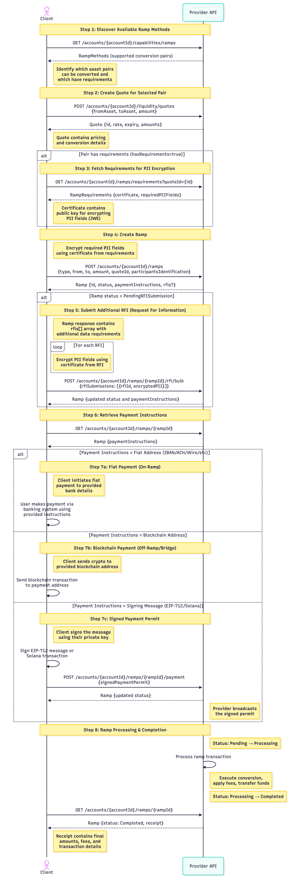

# Ramp Creation Flow

This document describes the complete flow for creating and executing a ramp transaction (on-ramp, off-ramp, or bridge).

## Sequence Diagram



> **Note:** The diagram source is available in [`ramp-creation-flow.mermaid`](./ramp-creation-flow.mermaid).
> To regenerate the image, you can use the [Mermaid CLI](https://github.com/mermaid-js/mermaid-cli):
>
> ```bash
> mmdc -i ramp-creation-flow.mermaid -o doc-assets/ramp-creation-flow.png -w 2000 -b transparent
> ```

## Flow Description

### 1. Fetch Ramp Capabilities

Retrieve the list of supported ramp methods to understand which asset pairs can be converted (fiat↔crypto, crypto↔crypto).

**Endpoint:** `GET /accounts/{accountId}/capabilities/ramps`

**Response includes:**

- List of supported conversion pairs
- Transfer methods (IBAN, Wire, PublicBlockchain, etc.)
- `hasRequirements` flag indicating if PII encryption is needed

### 2. Create a Quote

Create a quote for the selected conversion pair to lock in pricing and conversion rates.

**Endpoint:** `POST /accounts/{accountId}/liquidity/quotes`

**Request:**

```json
{
  "fromAsset": {"assetId": "..." or "nationalCurrencyCode": "USD"},
  "toAsset": {"assetId": "..." or "nationalCurrencyCode": "EUR"},
  "fromAmount": "1000.00"  // or toAmount
}
```

**Response includes:**

- Quote ID
- Calculated amounts
- Expiration time

### 3. Fetch Requirements (Conditional)

If the ramp method has `hasRequirements: true`, fetch the encryption requirements for PII fields.

**Endpoint:** `GET /accounts/{accountId}/ramps/requirements?quoteId={id}`

**Response includes:**

- Certificate (public key) for encrypting PII
- List of required PII fields (e.g., originator.fullName, beneficiary.dateOfBirth)
- Supported JWE algorithms and encryptions

**PII Encryption:**

1. Create an array of objects with `{name, value}` for each required field
2. Encrypt using JWE with the provided certificate
3. Result is a JWE string: `eyJhbGciOiJSU0EtT0FFUC0yNTYi...`

### 4. Create the Ramp

Initiate the ramp transaction with all required details and encrypted PII.

**Endpoint:** `POST /accounts/{accountId}/ramps`

**Request:**

```json
{
  "idempotencyKey": "unique-key",
  "type": "OffRamp",
  "amount": "1000.00",
  "from": {
    "asset": {"assetId": "..."},
    "transferMethod": "PublicBlockchain",
    "address": "0x..."
  },
  "to": {
    "asset": {"nationalCurrencyCode": "USD"},
    "transferMethod": "Iban",
    "accountHolder": {...},
    "iban": "..."
  },
  "executionDetails": {
    "type": "Quote",
    "quoteId": "quote-id"
  },
  "participantsIdentification": "eyJhbGci..." // JWE encrypted PII
}
```

**Response includes:**

- Ramp ID and status
- Payment instructions
- Optional: `rfis[]` array if additional information is required

### 5. Submit RFIs (Conditional)

If the ramp status is `PendingRFISubmission`, submit additional required information.

**Endpoint:** `POST /accounts/{accountId}/ramps/{rampId}/rfi/bulk`

**Request:**

```json
{
  "rfiSubmissions": [
    {
      "rfiId": "rfi-123",
      "type": "EncryptedPII",
      "encryptedPII": "eyJhbGci..." // JWE encrypted PII
    }
  ]
}
```

### 6. Get Ramp Details

Retrieve the ramp to access payment instructions.

**Endpoint:** `GET /accounts/{accountId}/ramps/{rampId}`

**Response includes:**

- Current status
- Payment instructions (varies by type)
- Estimated fees

### 7. Execute Payment

The payment method depends on the type of payment instructions:

#### 7a. Fiat Payment Instructions (IBAN/ACH/Wire)

Client initiates payment through traditional banking system using provided account details.

#### 7b. Blockchain Address

Client sends cryptocurrency to the provided blockchain address.

#### 7c. Signing Message (EIP-712 or Solana Transaction)

Client signs the message and submits the signature.

**Endpoint:** `POST /accounts/{accountId}/ramps/{rampId}/payment`

**Request:**

```json
{
  "signedPaymentPermit": "0x1234...signature"
}
```

### 8. Processing & Completion

The ramp transitions through statuses:

- `Pending` → Initial state, awaiting payment
- `PendingRFISubmission` → Awaiting additional information (optional)
- `Processing` → Payment received, conversion in progress
- `Completed` → Ramp successfully executed

**Possible final statuses:**

- `Completed` - Success
- `Failed` - Transaction failed
- `Canceled` - Canceled by user or system
- `Refunded` - Funds returned

## Status Lifecycle

```
┌─────────┐
│ Pending │
└────┬────┘
     │
     ├─────────────────────┐
     │                     │
     ▼                     ▼
┌──────────────────┐  ┌────────────┐
│PendingRFI        │  │ Processing │
│Submission        │  └─────┬──────┘
└────┬─────────────┘        │
     │                      │
     │ (after RFI submit)   │
     └──────────┬───────────┘
                │
                ▼
         ┌────────────┐
         │ Processing │
         └─────┬──────┘
               │
         ┌─────┴─────┬──────────┬──────────┐
         ▼           ▼          ▼          ▼
    ┌──────────┐ ┌────────┐ ┌────────┐ ┌──────────┐
    │Completed │ │ Failed │ │Canceled│ │ Refunded │
    └──────────┘ └────────┘ └────────┘ └──────────┘
```

## Notes

- **Idempotency:** Always use unique `idempotencyKey` to prevent duplicate transactions
- **Quote Expiration:** Quotes have expiration times; create ramp before expiry
- **PII Security:** Always encrypt sensitive PII data using JWE with provided certificates
- **Webhooks:** Consider implementing webhooks to receive status updates instead of polling
- **Fees:** Review `estimatedFees` before creating ramp; actual fees in `receipt.actualFees`
